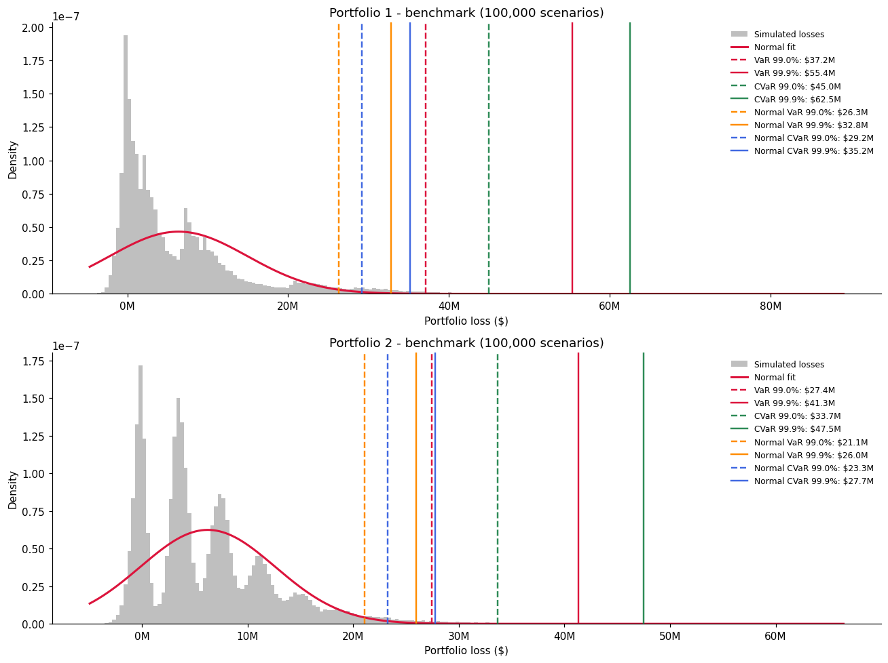
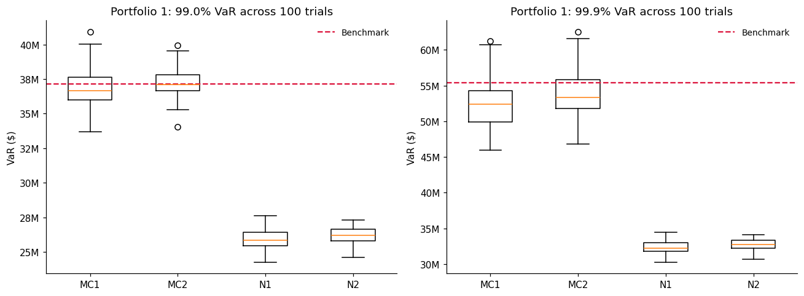
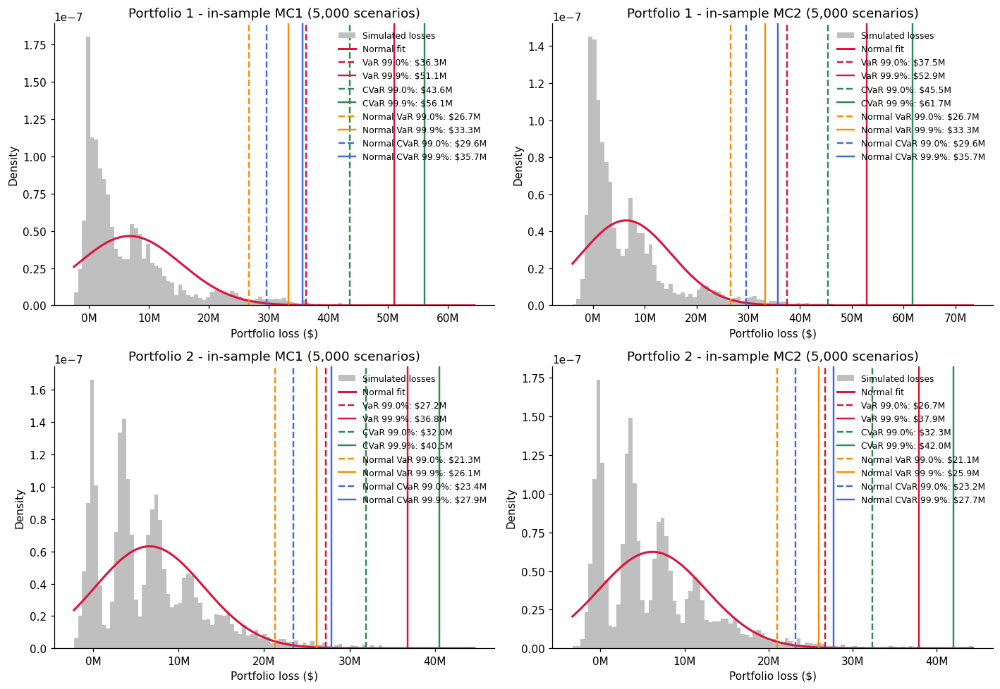

# Credit Risk Simulation: Sampling Error vs. Model Error

[](https://colab.research.google.com/github/YOUR-USERNAME/credit-risk-simulation/blob/main/credit_risk_simulation.ipynb)

Monte Carlo simulation of a corporate bond portfolio's one-year loss distribution under a
CreditMetrics-style latent Gaussian credit-migration model, used to separate two sources of error in a
reported risk number:

- **Sampling error** — the model is right, but the simulation is too small.
- **Distributional error** — the sample is large enough, but the assumed distribution is the wrong shape.

The headline result: with 5,000 scenarios the empirical estimators land within **1–5%** of a
100,000-scenario reference, while a normal law fitted to that same 100,000-scenario sample understates
the 99.9% CVaR by **44%**. More scenarios cannot fix an assumption that is wrong in shape.



*The grey histogram is the simulated loss distribution; the red curve is a normal fitted to the same
sample. The normal has to be symmetric, so its tail sits far short of where the empirical VaR and
CVaR actually fall.*

## Model

Each of the $K$ counterparties has a standard normal creditworthiness index

$$w_i = \beta_i  y_{d(i)} + \sqrt{1-\beta_i^2}  z_i$$

where $y \sim N(0, \rho)$ are correlated **systemic** credit drivers, $z_i \sim N(0,1)$ are
independent **idiosyncratic** shocks, and $d(i)$ maps a counterparty to its driver. The weights keep
$\mathrm{Var}(w_i) = 1$, which is what makes the credit-state thresholds line up with the
migration probabilities:

$$b_{i,c} = \Phi^{-1}\left(\sum_{j \le c} p_{i,j}\right), \qquad c = 1, \dots, C-1.$$

The realised credit state is the number of thresholds $w_i$ exceeds; each state carries a known
exposure, and on default only the non-recovered fraction is lost. Correlated drivers are generated by
rotating independent normals through the Cholesky factor of $\rho$.

**Data.** 100 counterparties across 50 credit drivers, 8 credit states (default through AAA),
portfolio value \$846M. Two portfolios are formed from the same names: value-weighted (Portfolio 1)
and equal-weighted in dollar terms (Portfolio 2).

## Experiment

| Estimator | Scenarios | Structure | Isolates |
|---|---|---|---|
| Benchmark | 100,000 | one systemic draw per scenario | higher-precision reference distribution |
| MC1 | 5,000 | 1,000 systemic × 5 idiosyncratic | sampling error, systemic tail under-sampled |
| MC2 | 5,000 | 5,000 systemic × 1 idiosyncratic | sampling error, systemic tail well covered |
| N1 / N2 | 5,000 | normal law fitted to the MC1 / MC2 sample | combined sampling and distributional error |

Every in-sample estimator is re-run over 100 independent trials, so both the average estimate and its
dispersion are measured. The 100,000-scenario run is itself a finite sample, not the true distribution;
it serves as a reference because its own sampling error is roughly an order of magnitude smaller than
that of the estimators being assessed against it.

## Results

Mean relative gap against the 100,000-scenario reference, averaged over both portfolios and 100 trials:

| Measure | MC1 | MC2 | N1 | N2 |
|---|---|---|---|---|
| VaR 99% | 1.0% | 0.2% | 27.0% | 26.2% |
| CVaR 99% | 2.4% | 0.5% | 33.7% | 33.1% |
| VaR 99.9% | 4.2% | 1.4% | 39.6% | 39.0% |
| CVaR 99.9% | 5.0% | 0.9% | 43.3% | 42.7% |

The N1 and N2 columns mix two effects, since those estimators use 5,000 scenarios while the reference
uses 100,000. Holding sample size fixed on both sides — the empirical measures of the 100,000-scenario
sample against a normal law fitted to *that same sample* — isolates the distributional error:

| Measure | Portfolio 1 | Portfolio 2 |
|---|---|---|
| VaR 99% | 29.2% | 23.2% |
| CVaR 99% | 35.1% | 31.0% |
| VaR 99.9% | 40.7% | 37.2% |
| CVaR 99.9% | 43.7% | 41.6% |



**Distributional error dominates.** The normal approximation is not merely noisy — it is biased low,
and the bias grows with the confidence level, reaching 44% for the 99.9% CVaR even when sample size is
held constant. A symmetric density matched to the first two moments of a right-skewed loss distribution
cannot reach the quantiles that matter for capital. Note that N1 and N2 have the *tightest* spread
across trials: a confidently reported wrong number.

**Where scenarios are spent matters more than how many.** MC1 and MC2 use the same 5,000 scenarios,
but MC1 visits only 1,000 states of the economy. Because the tail of a credit portfolio is driven by
systemic moves hitting many counterparties at once, reusing systemic draws leaves the tail thinly
sampled — MC1 is both more biased and more variable across trials at every confidence level.

**CVaR carries more information but is noisier here.** Averaged across trials, CVaR's relative
dispersion (7.4% for MC1, 6.1% for MC2) exceeds VaR's (5.8% and 4.9%) in all eight comparisons. At the
99.9% level only five of 5,000 observations sit beyond the quantile, so the tail average rests on a
handful of extreme draws while VaR reads a single order statistic from a denser part of the sample.
CVaR still describes loss severity beyond the quantile in a way VaR cannot; the two answer different
questions, and stability alone does not decide between them.



## Running it

Everything lives in one notebook.

**Colab:** click the badge at the top, then drag `instrum_data.csv` and `credit_driver_corr.csv` into
the file panel on the left and run all cells. The full experiment (100,000-scenario benchmark plus 100
trials) takes well under a minute.

**Locally:**

```bash
pip install -r requirements.txt
jupyter lab credit_risk_simulation.ipynb
```

## Repository contents

```
credit_risk_simulation.ipynb   full analysis: model, simulation, tables, figures
data/
  instrum_data.csv             100 counterparties: driver, beta, recovery, value, migration probabilities, exposures
  credit_driver_corr.csv       50x50 correlation matrix for the credit drivers
figures/                       figures used in this README
requirements.txt               package versions
```

## Notes on implementation

- **Scenario dimension vectorised, counterparty loop kept.** The simulation loops over counterparties
  so each line matches a term of the model, but `w` is an array over all scenarios rather than a
  single draw, and `np.searchsorted` maps the whole array to credit states at once.
- **CVaR with a fractional correction.** When $n\alpha$ is not an integer the quantile falls between
  two order statistics. Weighting that boundary observation by its fractional part makes the tail
  average use exactly $n(1-\alpha)$ observations' worth of tail probability, rather than rounding to a
  whole observation.
- **Consistent estimators across designs.** The benchmark and the in-sample trials use the same
  VaR/CVaR functions, so the reported differences reflect the sampling design rather than a change of
  formula.
- **Validated inputs.** The loader checks that migration probabilities sum to one and that every
  credit-driver index falls inside the correlation matrix, converting the 1-based driver column to
  0-based indices at the single point where the data is read.

## References

- Gupton, Finger and Bhatia (1997), *CreditMetrics Technical Document*, J.P. Morgan.
- Merton (1974), "On the Pricing of Corporate Debt", *Journal of Finance* 29(2).
- Rockafellar and Uryasev (2002), "Conditional Value-at-Risk for General Loss Distributions",
  *Journal of Banking & Finance* 26(7).
